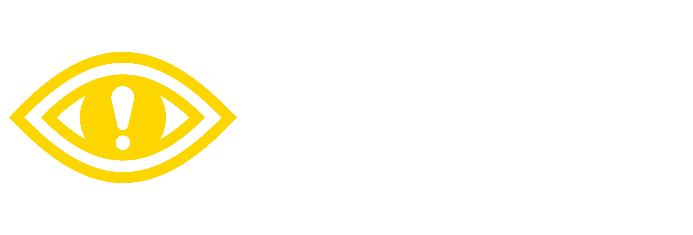

  <h1>Content Warning Project Patcher</h1>

  

  

    A game wrapper that generates a Unity project from Content Warning's build that can be playable in-editor.
  

 

<!-- Table of Contents -->
# Table of Contents

- [About the Project](#about-the-project)
- [Getting Started](#getting-started)
    * [Prerequisites](#prerequisites)
    * [Installation](#installation)
- [Usage](#usage)
- [FAQ](#faq)

<!-- About the Project -->
## About the Project
This tool is a game wrapper on top of the [Unity Project Patcher](https://github.com/nomnomab/unity-project-patcher).

This takes a build of Lethal Company, extracts its assets/scripts/etc, and then generates a project for usage in the Unity editor.

> [!IMPORTANT]  
> This tool does not distribute game files. It simply works off of your copy of the game!
>
> Also, this tool is for **personal** use only. Do not re-distribute game files to others.